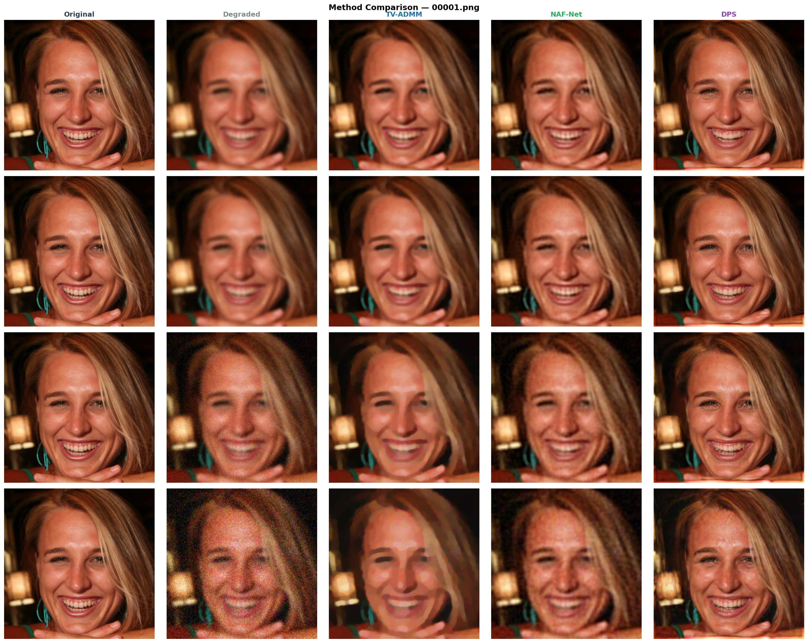

Computational Imaging — Joint Image Deblurring and Denoising

Group U | Academic Year 2025–2026

"Python" (https://img.shields.io/badge/Python-3.10+-blue)
"PyTorch" (https://img.shields.io/badge/PyTorch-2.x-red)
"License" (https://img.shields.io/badge/License-Academic-green)

«Comparative study of three methodological families for joint Gaussian image deblurring and denoising on FFHQ 256×256:

TV-ADMM (Variational Optimization) • NAF-Net (Deep Learning Restoration) • DPS (Generative Diffusion Models)»

---

Project Overview

Image restoration is a fundamental inverse problem in computational imaging. This project investigates three fundamentally different approaches for recovering images degraded by blur and additive Gaussian noise.

The comparison includes:

- TV-ADMM — a classical variational optimization method based on Total Variation regularization.
- NAF-Net — a modern deep neural network trained end-to-end for image restoration.
- DPS (Diffusion Posterior Sampling) — a generative diffusion-based approach exploiting powerful image priors.

All methods are evaluated under identical experimental conditions using the same dataset, degradation operator, random seed, and evaluation protocol to ensure a fair and reproducible comparison.

---

Visual Comparison

  

  <em>Example reconstructions produced by TV-ADMM, NAF-Net and DPS under different noise levels.</em>

---

Table of Contents

- "Project Overview" (#project-overview)
- "Visual Comparison" (#visual-comparison)
- "Results Summary" (#results-summary)
- "Key Findings" (#key-findings)
- "Repository Structure" (#repository-structure)
- "Setup" (#setup)
- "Dataset" (#dataset)
- "Method 1 — TV-ADMM" (#method-1--tv-admm)
- "Method 2 — NAF-Net" (#method-2--naf-net)
- "Method 3 — DPS (Google Colab)" (#method-3--dps-google-colab)
- "Evaluation & Plots" (#evaluation--plots)
- "Quick Start" (#quick-start)
- "Conclusion" (#conclusion)
- "References" (#references)
- "Reproducibility Notes" (#reproducibility-notes)

---

Results Summary

Degradation Model

[
y = A(x) + n
]

Parameter| Value
Forward operator A| Gaussian blur
Blur σ| 2
Kernel size| 9×9
Noise type| Additive Gaussian
Noise levels| 0.005, 0.01, 0.05, 0.1

All methods use exactly the same degraded images generated from a fixed random seed.

---

PSNR (dB) ↑

Method| σ=0.005| σ=0.01| σ=0.05| σ=0.1
TV-ADMM| 29.78| 29.42| 28.07| 26.56
NAF-Net| 29.46| 29.37| 28.07| 26.64
DPS| 25.56| 24.63| 24.63| 24.80

---

SSIM ↑

Method| σ=0.005| σ=0.01| σ=0.05| σ=0.1
TV-ADMM| 0.873| 0.856| 0.796| 0.739
NAF-Net| 0.867| 0.863| 0.797| 0.720
DPS| 0.790| 0.810| 0.737| 0.690

«TV-ADMM and NAF-Net were evaluated on 100 test images per noise level. DPS was evaluated on 5 test images per noise level due to its significantly higher computational cost.»

---

Key Findings

- TV-ADMM achieved the strongest overall PSNR performance.
- NAF-Net reached comparable results while relying on a single trained model.
- DPS produced visually realistic reconstructions but lower distortion metrics.
- Classical variational optimization remains highly competitive for Gaussian deblurring and denoising.
- The benchmark highlights the trade-off between perceptual quality and reconstruction fidelity.

---

Repository Structure

computational-imaging-deblur/
│
├── data/
│   ├── degradation.py
│   ├── prepare_dataset.py
│   ├── generate_degraded.py
│   └── README.md
│
├── methods/
│   ├── tv/
│   ├── nafnet/
│   └── dps/
│
├── evaluation/
│   ├── metrics.py
│   ├── evaluate_all.py
│   └── plot_results.py
│
├── experiments/
│   ├── run_tv.py
│   ├── run_nafnet.py
│   └── run_all.py
│
├── notebooks/
│   └── DPS.ipynb
│
├── results/
│   ├── metrics.json
│   ├── plots/
│   └── images/
│
├── requirements.txt
└── README.md

---

Setup

Clone the repository

git clone https://github.com/Giovanniprevitera01/computational-imaging-deblur.git
cd computational-imaging-deblur

Create a virtual environment

python3 -m venv venv
source venv/bin/activate

Windows:

venv\Scripts\activate

Install dependencies

pip install --upgrade pip
pip install -r requirements.txt

Create package initialization files

touch data/__init__.py
touch methods/__init__.py
touch methods/tv/__init__.py
touch methods/nafnet/__init__.py
touch methods/dps/__init__.py
touch evaluation/__init__.py
touch experiments/__init__.py

---

Dataset

Download FFHQ 256×256

Kaggle CLI

pip install kaggle
kaggle datasets download denislukovnikov/ffhq256-images-only
unzip ffhq256-images-only.zip -d data/raw/ffhq256/

Manual Download

Dataset:

https://www.kaggle.com/datasets/denislukovnikov/ffhq256-images-only

Extract all files to:

data/raw/ffhq256/

---

Prepare Dataset

python3 data/prepare_dataset.py
python3 data/generate_degraded.py

Expected split:

Train: 1400 images
Validation: 300 images
Test: 300 images

---

Method 1 — TV-ADMM

No training is required.

Run evaluation:

python3 experiments/run_tv.py --max_images 100

Single noise level:

python3 experiments/run_tv.py --sigma 0.05 --max_images 100

Best λ values:

Noise σ| λ
0.005| 0.001
0.01| 0.005
0.05| 0.020
0.1| 0.050

---

Method 2 — NAF-Net

Training

python3 methods/nafnet/train.py --epochs 30 --batch_size 4

Checkpoint:

checkpoints/nafnet_best.pth

Evaluation

python3 experiments/run_nafnet.py --max_images 100

The network uses noise-level conditioning, allowing a single model to process all degradation levels.

---

Method 3 — DPS (Google Colab)

DPS requires GPU acceleration and was executed using a Google Colab T4 GPU.

Open Notebook

Upload:

notebooks/DPS.ipynb

to:

https://colab.research.google.com

Enable:

Runtime → Change runtime type → T4 GPU

---

DPS Parameters

Parameter| Value
Diffusion steps| 200
ζ (zeta)| 1.0
σy| Equal to noise level
Post-processing| Gaussian blend

Additional blending:

Noise σ| α
0.05| 0.10
0.10| 0.15

---

Integrate DPS Results

After downloading the generated outputs from Colab:

unzip dps_results.zip -d dps_colab/

Copy images:

cp -r dps_colab/results/* results/images/

Merge metrics:

python3 merge_dps_metrics.py

---

Evaluation & Plots

Generate all figures:

python3 evaluation/plot_results.py

Generated files:

results/plots/psnr_vs_sigma.png
results/plots/ssim_vs_sigma.png
results/plots/combined_comparison.png
results/plots/visual_grid_1.png

---

Quick Start

git clone https://github.com/Giovanniprevitera01/computational-imaging-deblur.git

cd computational-imaging-deblur

python3 -m venv venv
source venv/bin/activate

pip install -r requirements.txt

python3 data/prepare_dataset.py
python3 data/generate_degraded.py

python3 experiments/run_tv.py --max_images 100

python3 methods/nafnet/train.py --epochs 30 --batch_size 4
python3 experiments/run_nafnet.py --max_images 100

# Run DPS notebook on Google Colab

python3 evaluation/plot_results.py

---

Conclusion

This project compares three fundamentally different paradigms for image restoration under the same degradation model.

The results indicate that:

- TV-ADMM achieves the strongest quantitative performance.
- NAF-Net provides highly competitive restoration quality with efficient inference.
- DPS benefits from powerful generative priors and visually plausible reconstructions, although it trails behind in PSNR and SSIM.

Overall, the benchmark highlights the strengths and limitations of variational, discriminative, and generative approaches to inverse imaging problems.

---

References

1. Rudin, Osher & Fatemi (1992) — Nonlinear Total Variation Based Noise Removal Algorithms.
2. Boyd et al. (2011) — Distributed Optimization and Statistical Learning via ADMM.
3. Chen et al. (2022) — Simple Baselines for Image Restoration (NAF-Net).
4. Chung et al. (2023) — Diffusion Posterior Sampling for General Noisy Inverse Problems.
5. Blau & Michaeli (2018) — The Perception–Distortion Tradeoff.
6. Dhariwal & Nichol (2021) — Diffusion Models Beat GANs on Image Synthesis.
7. Karras et al. (2019) — A Style-Based Generator Architecture for GANs (FFHQ).

---

Reproducibility Notes

- Fixed random seed = 42
- Identical degradation pipeline for all methods
- Shared Gaussian blur operator and noise realizations
- NAF-Net checkpoint not included in the repository
- DPS relies on a pre-trained diffusion model downloaded automatically in Google Colab
- All reported metrics were computed using the same evaluation protocol
- Results can be reproduced by following the workflow described above
